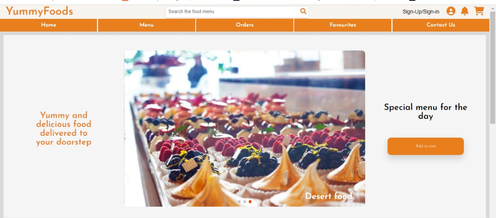
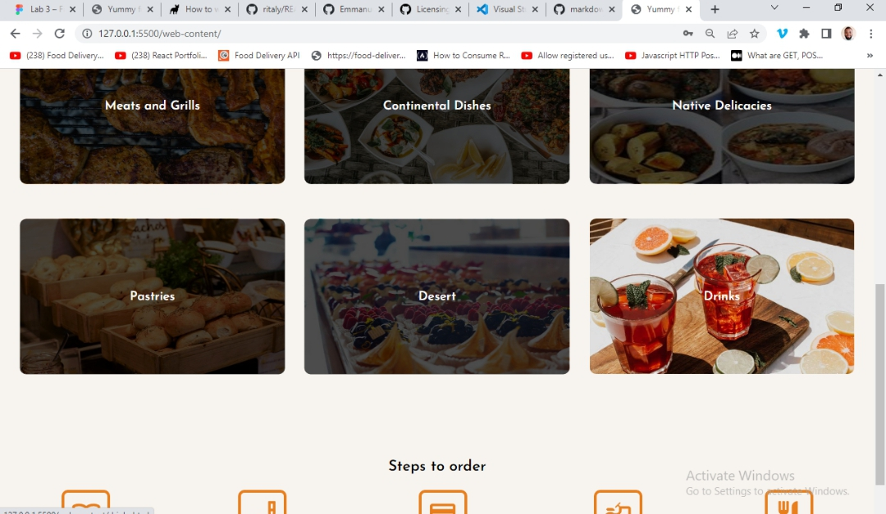
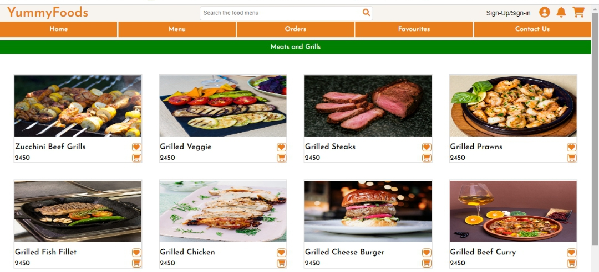
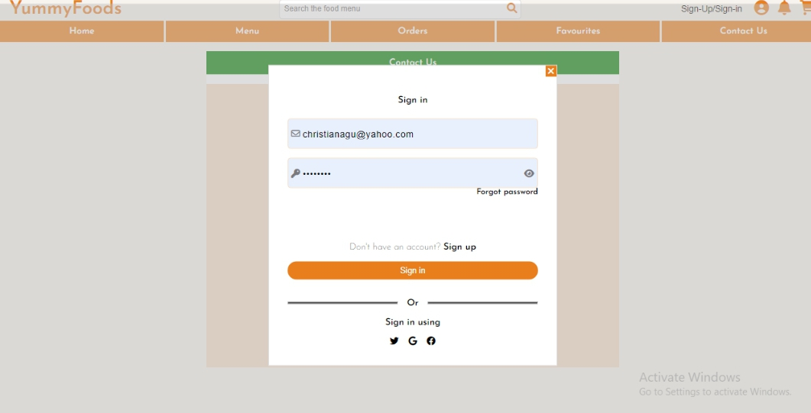
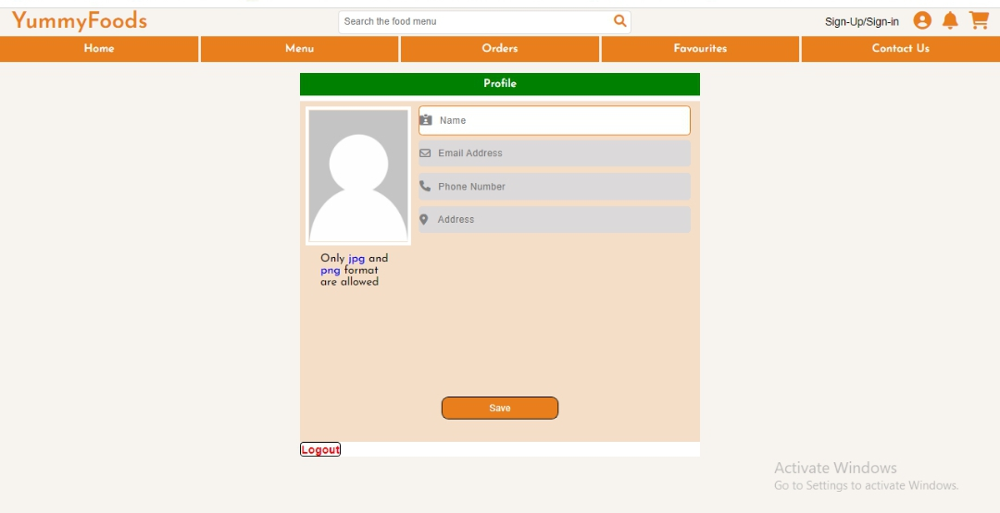
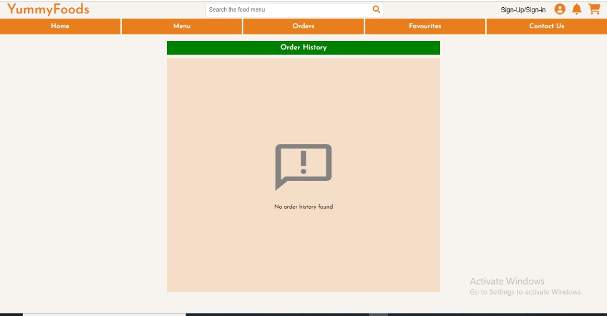
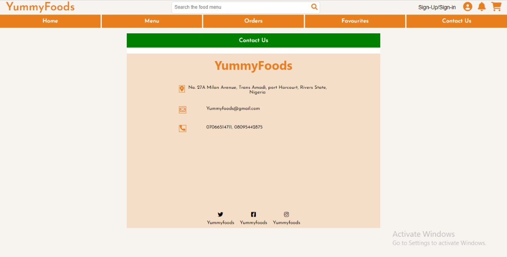

# YUMMYFOODS

## GENERAL iNFORMATION

This project involves the development of a responsive website to help people within a locality order for food with less stress and optimize the productivity of employees. Yummyfoods is a project undertaking by students in Seamfix NextGen Academy for the completion of a 6 months training on web development.

## Table of Content

* [General info](#general-information)
* [Table of Content](#table-of-content)
* [Introduction](#introduction)
* [Technologies](#technologies)
* [Illustration](#illusrations)
* [Scope of Functionalities](#scope-of-functionalities)
* [Project Status](#project-status)
* [Sources](#sources)
* [Launch](#launch)
* [Room For Improvement](#room-for-improvement)
* [Other Information](#other-information)

## Introduction

Yummyfoods is a concept born out of the desire to help people save time and promote better output in terms of work as an employee/employer would not need to queue up to get their desired meal but rather get served in their work space. This project was then brought to life three teams, they include; the Design team, Frontend team and  Backend team.  

## Technologies

In order to actaulize this project from the frontend team, the following technologies were used.

1. VScode `v1.70.1`
2. JavaScript
3. Live Sass Compiler `v5.5.1`
4. HTML5
5. Font Awesome Icons `v4.7.0 and v6.1.1`
6. J-Query `v3.2.1`

## Illusrations

## Scope of Functionalities

### Features

* A welcoming home that makes customers hunger for quality meal.
* Well crafted Interface with good communication between users and the system.
* Easy toggle on the menu bar to selects food items with automated calculations.
* Pages that allows customers track their orders, view their order history and even re-order food items.
* Listing your favourite food and have easy access to them as well as re-rodering.
* A responsive websites with several device compactability. Typically Desktop, Tablet and Mobile.

## Project Status

For the purpose this project is intended, it has elapsed its development time. However it's not yet complete.

## Sources

This project was inspired by SeamFix NextGen programe. But was able to be a reality through several sources on Youtube and Google. For example;

* [Stack-Overflow](https://stackoverflow.com)
* [Coding Artist](https://stackoverflow.com)
* [openjavascript](https://www.youtube.com/watch?v=TTf0mMl0Sc4)
* [khaiser khanam](https://www.youtube.com/watch?v=m_vL25vzpiE)

## Launch

``
To run this project on your local machine, simply follow the steps below.
    - Install [Vscode](https://code.visualstudio.com/)
    - Go to [GitHub](https://github.com/Emmanuel-obiora/Yummy-foods)
    - Click on CODE and copy the HTTPS link to clone the project.
    - From your VScode terminal clone the project
    - Finally click GO Live to view on browser if live server is installed.
    - Else right click on the index file and click on open with (any browser installed on your pc would show here)

Or you can view the publish work by clicking this link [Yummyfoods](https://yummyfoods.com)
``

## Room For Improvement

* A more roburst tracking system like Google-map.
* A more compelling interface.
* Advancement in terms of technology used.
* Sign in/Sign up using social media accounts

### To-Do

* Pop-up for every response rather than alert.
* Implementing Google map.
* Impleting other links sign in/sign up.

## Other Information

### Authors

👤 **Obiora Emmanuel**

* Github: [Emmanuel-obiora](https://github.com/Emmanuel-obiora)
* Twitter: [Miroclesdgenius](https://twitter.com/Miroclesdgenius)
* Linkedin: [obiora-emmanuel](https://www.linkedin.com/in/obiora-emmanuel-b4935616a/)

👤 **Odeyemi Oluwatobiloba**

* Github: [Odeyemi Oluwatobiloba](https://github.com/Odeyemitobi)
* Linkedin: [Odeyemi Oluwatobiloba](https://www.linkedin.com/in/Odeyemi-Oluwatobiloba/)

### Show your support

Give a ⭐️ if you like this project!

### 📝 License

This project is [MIT](https://docs.github.com/en/github/creating-cloning-and-archiving-repositories/licensing-a-repository) licensed.
